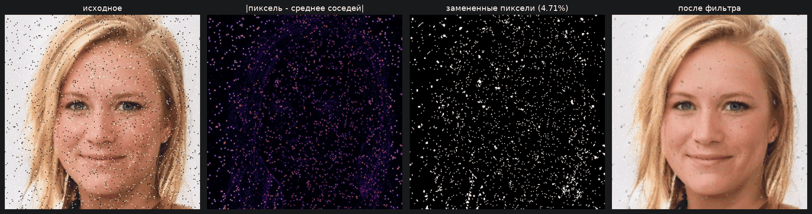
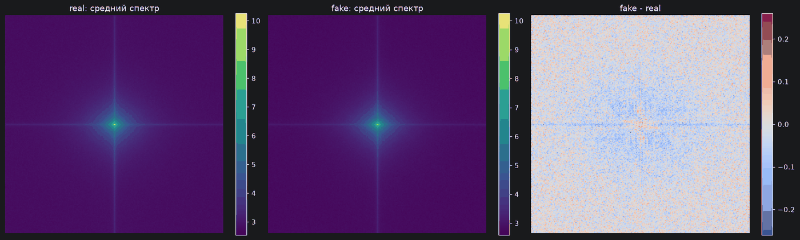

# Детекция дипфейков

[](https://github.com/Alex-Andr-Hue/deepfake-detection/actions/workflows/tests.yml)


Сравнение свёрточных архитектур для отличения синтетических лиц от настоящих.
Восемь моделей — от простой CNN до Inception V3 — реализованы с нуля на PyTorch
и прогоняются через **единый протокол**, чтобы разница в метриках объяснялась
моделями, а не разными условиями запуска.

Датасет: 50 000 изображений лиц 256×256, из них 17% синтетические. Данные
зашумлены импульсным шумом.

---

## Что в этом проекте интересного

**Протокол сравнения, который выдерживает критику.** Самая частая ошибка в
подобных сравнениях — обучать модели поверх весов предыдущего эксперимента и
пересобирать val/test случайно перед каждым запуском. Тогда разница между
строками таблицы объясняется порядком запуска, а не архитектурой. Здесь:

- каждый эксперимент стартует со свежих весов (`build_model()`);
- hold-out отбирается детерминированно, деление на val/test — генератором с
  фиксированным seed, поэтому все модели видят **одни и те же** выборки;
- бюджет обучения одинаков для всех;
- чекпоинт и порог отбираются по валидации, метрики снимаются с теста.

**Метрики без типичных ловушек.** ROC-AUC считается по вероятностям, а не по
жёстким меткам (AUC от бинарных предсказаний — это балансированная точность,
другая величина). Порог решения подбирается по валидации, а не фиксируется на
0.5: при дисбалансе 5:1 `argmax` систематически недобирает recall.

**Частотная ветвь под специфику задачи.** Генеративные модели оставляют
регулярные высокочастотные следы. `FrequencyAware` подаёт в сеть исходное
изображение вместе с высокочастотным остатком `x - среднее по окну`, чтобы
не заставлять её заново изобретать этот фильтр первыми свёртками.

**Осмысленная предобработка.** Шум убирается точечно: заменяются только пиксели,
выбивающиеся из своей окрестности, и заменяются средним по соседям. Сплошное
сглаживание здесь вредно — артефакты генерации лежат в том же частотном
диапазоне, что и шум, и грубый фильтр стирает признак вместе с помехой.

---

## Что видно в данных

Разведочный анализ — [`notebooks/01_eda.ipynb`](notebooks/01_eda.ipynb).

### Фильтр шума работает точечно



Заменено 4.71% пикселей — ровно те, что выбиваются из своей окрестности.
Остальное изображение не тронуто: текстура кожи и волос, на которой держится
распознавание, сохраняется полностью.

### Частотный признак действительно есть



Средний лог-амплитудный спектр по 300 изображениям каждого класса и их разность.
Однородный шум в правой панели означал бы, что частотной информации для
классификации нет. Вместо этого видна структура: тёмный крест по осевым частотам
и систематические различия в средней зоне — синтетические изображения
распределяют энергию по спектру иначе, чем настоящие.

Это замер, а не гипотеза, и именно он оправдывает ветку `FrequencyAware`:
признак в данных присутствует ещё до всякого обучения.

---

## Результаты

> **Статус:** пайплайн и данные готовы, полный прогон восьми моделей ещё идёт —
> таблица с метриками появится здесь по его завершении. Разведочный анализ выше
> уже сделан на полном датасете.

Отчёт [RESULTS.md](RESULTS.md) генерируется скриптом из
`results/model_comparison.csv`, поэтому цифры в нём не могут разойтись с
посчитанными — их нельзя подправить руками.

Проект отвечает на четыре вопроса, и каждый — это пара экспериментов,
отличающихся ровно одним фактором:

| Вопрос | Сравниваются |
|---|---|
| Что даёт очистка от шума? | `InceptionV1` против `InceptionV1 (шумные)` |
| Что даёт частотная ветвь? | `InceptionV1+Freq` против `InceptionV1` |
| Сколько стоит обучение с нуля? | `ResNet18 (ImageNet)` против `ResNet18` |
| Работает ли шум как предобучение? | `InceptionV1 (шум → чистые)` против `InceptionV1` |

---

## Установка

```bash
git clone https://github.com/Alex-Andr-Hue/deepfake-detection
cd deepfake-detection
python -m venv .venv && source .venv/bin/activate   # Windows: .venv\Scripts\activate
pip install -r requirements.txt
pip install -e .
```

Данные положите в `data/raw/`:

```
data/raw/
├── train_images/        # 50 000 файлов <id>.jpg
├── test_images/         # 10 000 файлов <id>.jpg
└── train_solution.csv   # id,label без заголовка
```

Если датасет лежит в другом месте — укажите путь переменной окружения:

```bash
export DEEPFAKE_DATA=/path/to/data
```

## Запуск

```bash
# 1. разложить по классам, убрать шум, выровнять классы
python scripts/prepare_data.py --all

# 2. прогнать все эксперименты (долго; --epochs 5 для быстрой проверки)
python scripts/train.py --all

# 3. собрать RESULTS.md и график сравнения
python scripts/report.py

# 4. предсказания обученной моделью
python scripts/predict.py --model InceptionV1 \
    --checkpoint checkpoints/inceptionv1.pth \
    --images data/processed/clean_test_images \
    --output results/submission.csv
```

Отдельные модели:

```bash
python scripts/train.py --models ResNet18 InceptionV1
```

## Тесты

```bash
pip install -r requirements-dev.txt
pytest
```

59 тестов, проходят на CPU за пару минут и не требуют датасета — все фикстуры
синтетические. Покрыты фильтр шума, детерминированность разбиения, отсутствие
пересечения train и hold-out, корректность метрик и сквозной цикл обучения.

---

## Структура

```
deepfake-detection/
├── src/deepfake/
│   ├── config.py          пути, гиперпараметры, фиксация seed
│   ├── denoise.py         удаление шума средним по соседям
│   ├── data.py            разбиение, балансировка, загрузчики
│   ├── metrics.py         метрики, подбор порога, реестр результатов
│   ├── training.py        цикл обучения и инференс
│   ├── experiment.py      оркестрация одного эксперимента
│   └── models/
│       ├── cnn.py         базовая свёрточная сеть
│       ├── resnet.py      ResNet18, ResNet50
│       ├── inception.py   Inception V1, Inception V3
│       ├── unet.py        U-Net как классификатор
│       └── frequency.py   высокочастотная ветвь и спектральный анализ
├── scripts/               CLI: prepare_data, train, predict, report
├── notebooks/             EDA и разбор результатов
├── tests/                 pytest
└── results/               таблица сравнения и графики
```

## Архитектуры

| Модель | Параметров | Комментарий |
|---|---:|---|
| CNN | 2.2M | базовая линия |
| U-Net | 1.9M | энкодер-декодер, приспособленный под классификацию |
| InceptionV1 | 6.0M | параллельные ветви с разными рецептивными полями |
| InceptionV1+Freq | 6.0M | то же плюс высокочастотный остаток на входе |
| ResNet18 | 11.2M | остаточные связи |
| ResNet18 (ImageNet) | 11.2M | те же слои, но предобученные |
| InceptionV3 | 20.2M | факторизованные свёртки, блоки A/B/C |
| ResNet50 | 23.5M | bottleneck-блоки |

## Стек

PyTorch, torchvision, scikit-learn, OpenCV, pandas, matplotlib, pytest.

## Лицензия

MIT — см. [LICENSE](LICENSE).
